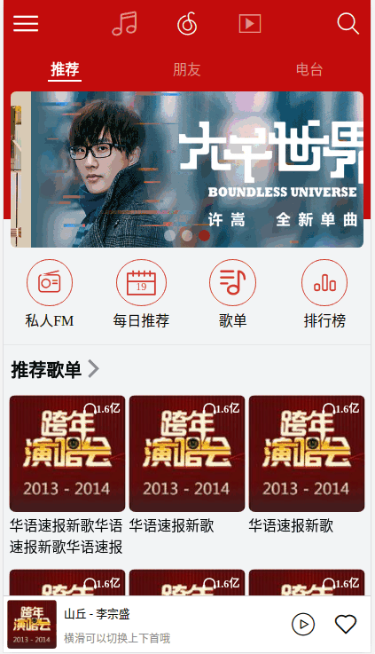
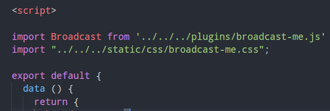

# 轮播图插件(Broadcast.js)

### 前言：写这个插件的原因

* 前段时间准备用vue加上网易云的nodejs接口，模拟网易云音乐移动端。因为想自己写一遍所有的代码以及加固自己的flex布局，所以没有使用UI组件。在轮播图部分，本来在vue里面写了一下，但是发现总是出现bug,所以后来准备封装一个插件来实现。
* 其次的一个原因是，以为这一学期学vue一直在用vue，发现自己以前学的原生js有点遗忘，所以想借这个机会再次复习一下js。

### 功能&介绍

* 没有引用第三方插件库，原生js，封装一个Broadcast对象，在此对象上展开，仅仅190多行代码。
* 目前主要实现了:无缝轮播，自动播放，PC端左右按钮点击切换，移动端手势滑动切换。
* 自己写了一部分基础的css样式，可以再次的基础上修改成自己喜欢的样式。


### 展示界面&使用

- github地址： [git仓库地址](https://github.com/LiChangyi/broadcastJs)
- 演示demo： [在线浏览地址](https://lichangyi.github.io/broadcastJs/src/index.html)

* PC端展示：

  ​	

* 移动端展示：

  ​	


### Usage

#### 普通页面引用

1. 复制github仓库下面，`src/js `文件下的 `broadcast-me.js`  放到自己项目文件中

2. 复制github仓库下面，`src/css` 文件下的 `broadcast-me.css`  放到自己项目文件中

3. 在页面中引入:

   ```` html
   <!DOCTYPE html>
   <html lang="en">
   <head>
     <meta charset="UTF-8">
     <meta name="viewport" content="width=device-width, initial-scale=1.0">
     <meta http-equiv="X-UA-Compatible" content="ie=edge">
     <title>Document</title>
     <!-- 引入插件的css文件 -->
     <link rel="stylesheet" href="./css/broadcast-me.css">
   </head>
   <body>
     <!-- 引入插件的js文件 -->
     <script src="./js/broadcast-me.js"></script>
   </body>
   </html>
   ````

4. 在后面如果需要一个轮播图，则实列化这个对象：

   ``` javascript
   var box = document.getElementById('box');
   var imagesAndUrl = [{
     imgSrc : './img/1.jpg',
     linkHref : "#"
   },{
     imgSrc : './img/2.jpg',
     linkHref : '1'
   },{
     imgSrc : './img/3.jpg',
     linkHref : '#'
   },{
     imgSrc : './img/4.jpg',
     linkHref : '#'
   },{
     imgSrc : './img/5.jpg',
     linkHref : '#'
   }];
   // box => 你需要创建轮播图的父级元素
   // imagesAndUrl => 数组，存放图片地址以及图片的连接地址
   var broadcast = new Broadcast(box,imagesAndUrl,{
         transitionTime : 800, // 动画过渡时间，默认为800ms
         intervalTime : 5000 // 图片切换时间，默认为5s
    });
   ```


#### VUE中引用

1. 在vue中使用，在`broadcast-me.js` 文件最后加上：

``` javascript
// 向外界暴露Broadcas对象
module.exports = Broadcast;
```

2. 在需要使用轮播的组件中，引入我们的文件



3. 在模板文件中，采用自定义指令的方式，来插入我们的轮播图

``` vue
<template>
  <div class="broadcast" v-broadcast="broadcastImg">
     <!-- 自定义指令broadcast，，形参 => broadcastImg 为我们的轮播图数据 -->
  </div>
</template> imgSrc : './img/5.jpg',
  linkHref : '#'
}
```

4. 添加自定义指令：

``` javascript
directives:{
  broadcast:{
    inserted:function(el,binding) {
      // binding.value 为我们传入的形参，即图片的地址和图片点击链接
      var broadcast = new Broadcast(el,binding.value,{
        transitionTime : 800, // 动画过渡时间，默认为800ms
        intervalTime : 5000 // 图片切换时间，默认为5s
      });
    }
  }
}
```


#### API

``` javascript
// 构造的对象
new Broadcast (el,imagesAndUrl,JSON)
```

| 属性           | 说明                                       | 备注备注                        |
| ------------ | :--------------------------------------- | --------------------------- |
| el           | 你需要创建轮播图的包裹(父级)元素                        | 不写报错                        |
| imagesAndUrl | 图片的地址与图片地址链接。数组对象  linkHref => 图片点击链接；imgSrc => 图片地址 | 不写报错                        |
| JSON         | transitionTime => 动画过渡时间， intervalTime => 动画切换时间 | 默认:过渡时间 => 800ms 切换时间 => 5s |


### 代码编写思路

##### dom 节点的动态生成

1. 通过 el 的宽度，生成一个动态css加入到页面当中

``` javascript
// 动态添加一些css样式
let cssStr = `.broadcastMe .broadcastMe-list {width: ${(this.imagesAndUrl.length+2)*this.el.clientWidth}px;}.broadcastMe .broadcastMe-list .broadcastMe-item {width:${this.el.clientWidth}px;}`;

let styleNode = document.createElement('style');
styleNode.innerText = cssStr;
document.head.appendChild(styleNode)
```

2. 通过字符串模板的形式，生成我们需要的且符合无缝轮播的html字符串，加载el节点当中。


##### 移动端手势滑动

通过：touchstart => touchmove => touchend 完成一个滑动的全过程，并在touchmove事件当中，改变当前的left值，并在touchend事件当中判断左右2边的距离，进行翻页还是不变。

``` javascript
// 移动端手指滑动
let stratPointX = 0;
let offsetX = 0;
this.el.addEventListener("touchstart", (e) => {
  stratPointX = e.changedTouches[0].pageX;
  offsetX = this.broadcastMeList.offsetLeft;
  this.animationMark = true;
})
this.el.addEventListener("touchmove", (e) => {
  let disX = e.changedTouches[0].pageX - stratPointX;
  let left = offsetX + disX;

  this.broadcastMeList.style.transitionProperty = 'none';
  this.broadcastMeList.style.left = left + 'px';
})
this.el.addEventListener("touchend", () => {
  let left = this.broadcastMeList.offsetLeft;
  // 判断正在滚动的图片距离左右图片的远近，
  this.index = Math.round(-left/this.el.clientWidth);
  this.animationMark = false;
  this.render();
})
```


##### 渲染函数(☆)

```javascript
Broadcast.prototype.render = function () {
  // 防抖控制
  if(this.animationMark) return;

  this.animationMark = true;
  // 修改broadcastMeList 的left值
  this.broadcastMeList.style.left = (-1)*this.el.clientWidth*this.index + 'px';
  this.broadcastMeList.style.transition = 'left ' + this.timer/1000 + 's';

  setTimeout(() => {
    // 添加判断，防止出界
    if(this.index <= 0){
      // 无缝轮播，修改真实的left值，取消transition，造成视觉错误
      this.broadcastMeList.style.transitionProperty = 'none';
      this.index = this.imagesAndUrl.length;
      this.broadcastMeList.style.left = (-1)*this.el.clientWidth*this.index + 'px';
    }else if (this.index > this.imagesAndUrl.length){ 
      this.broadcastMeList.style.transitionProperty = 'none';
      this.index = 1;
      this.broadcastMeList.style.left = (-1)*this.el.clientWidth*this.index + 'px';
    }
    this.animationMark = false;
  },this.timer)

  this.renderSpot();
}
```


### 最后

因为才疏学浅，代码才刚刚写完，测试较少，很多bug还未发现，如果发现问题，欢迎留言指出，敬请斧正。谢谢！！


### 感谢(BUG反馈)

* 感谢掘金论坛`wensent`提出的BUG，针对移动端不能识别mouseover事件，所以导致移动端刚滑动改变一张图片，然后定时器重新覆盖的问题。。现BUG已经被修改，添加了代码：在touchstart中清楚定时器，在touchend中在开启

